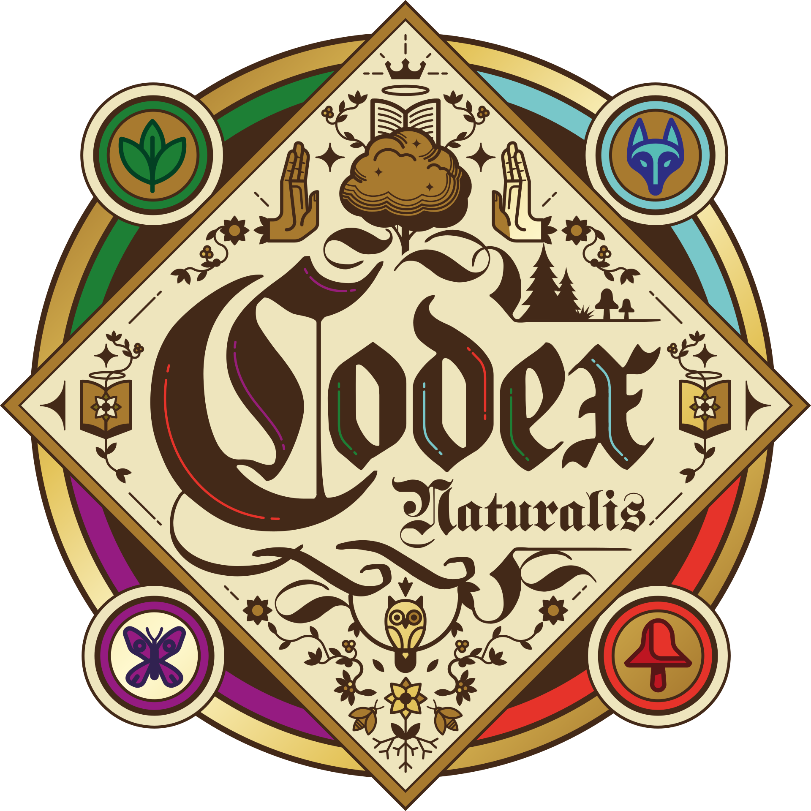
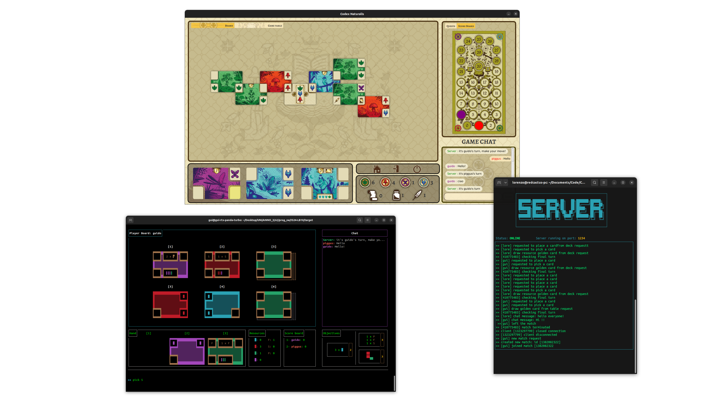

# Software Engineering Project - 2023-2024



Digitalization of the game [Codex Naturalis](https://www.craniocreations.it/prodotto/codex-naturalis).
The project consists of a single executable .jar file which can be used to deploy either a game server or a client.
A server can manage multiple games simultaneously, each game is made of 2 to 4 players.
Each player can choose to play using either the Command Line Interface or the Graphical User Interface.
The project relies on the Model-View-Controller design pattern and on a Visitor pattern for server request-reply dispatch.
More information about design patterns and project's architecture can be found [here](deliverables/).

## Documentation

### UML

UML diagrams can be found below:

- [Model](deliverables/FinalUML/images/Model.png)
- [Client](deliverables/FinalUML/images/Client.png)
- [Server](deliverables/FinalUML/images/Server.png) with [Network Documentation](deliverables/NetworkLayerDocs/Network.md)

### JavaDoc

The following documentation includes information about most relevant classes and methods: [Javadoc](deliverables/JavaDoc/index.html)

### Test Coverage

Our focus on testing was mainly on Model's algorithms. <br/>
The JUnit [tests](src/test/java) provide a line coverage of 97%, and we managed to test every class of the model.

### Tools

| Lib/Plugin   | Description           |
|--------------|-----------------------|
| __Maven__    | Build automation tool |
| __JavaFx__   | Java GUI Framework    |
| __JUnit__    | Testing Framework     |
| __PlantUML__ | UML design tool       |

## Features

| Feature            | Status |
|--------------------|--------|
| __Complete rules__ | ✅      |
| __CLI__            | ✅      |
| __GUI__            | ✅      |
| __Chat__           | ✅      |
| __Multiple Games__ | ✅      |

## Running the application

The [precompiled jar]() can be used to run the application. <br />
To independently create a client application jar, execute the following command in the project root:

```
mvn clean install assembly:single
```

The compiled jar will be found in ```target/``` under the name ```Codex-1.0.jar```. <br />
To run the application launcher, open the terminal and run ```java -jar Codex-1.0.jar```.
The user can choose to run a server or a client, either on the CLI or GUI, after the application has started.

## CLI and GUI interfaces



## Group members

- [__Abate Kevin Pio__](https://github.com/keevin16)
- [__Bottaro Simone Pio__](https://github.com/)
- [__Cestele Guido__](https://github.com/guido_cestele)
- [__Pigato Lorenzo__](https://github.com/lorenzo-pigato)