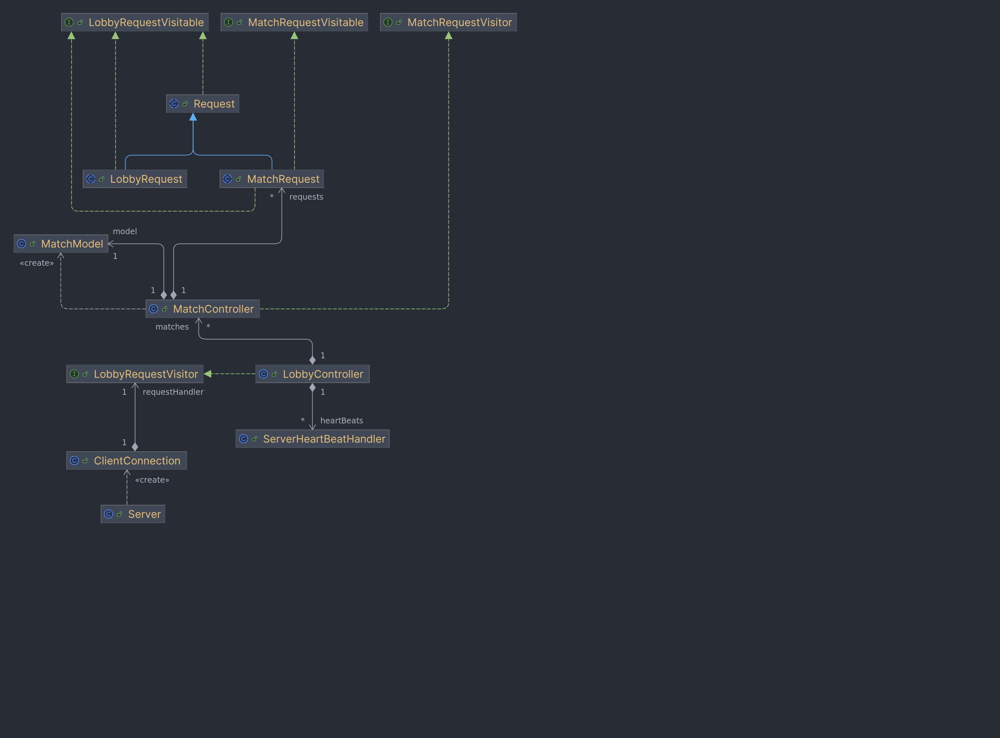

# Network layer

The main classes of our network layer are __Request__ and __Response__, every type of Request and Response that can be involved in Client-Server communication is represented by specific classes, which extends either Request or Response class.

These two classes, and their inheritors, are the only objects being serialized during communication.

## Visitor pattern

Client and server communicate exchanging requests and response: client sends requests and receives responses and server receives requests and sends response.
Both client and server implement the  __visitor design pattern__ to handle __specific__ requests or response.

Visitor pattern provides an efficient design pattern which permits to select specific method to handle a Request or Response received through serialization by evaluating its dynamic type using two main interfaces : __Visitor__ (for the handler) and __Visitable__ (for the handled).

Visitor interfaces has one method :
~~~
void visit (Visitable visitable).
~~~

Visitable interface has one method :  
~~~ 
void accept(Visitor visitor).
~~~

Request and Response handling is quite simple: every visitable object implements __accept__ method in this way:

~~~
public void accept (Visitor visitor){
    visitor.visit(this);
}
~~~

while every visitor object implements __visit__ method in this way:

~~~
public void visit (Visitable visitable){

//handling

}
~~~

The key concept is that every Visitor object implements a specific visit method for every specific Visitable object, this has permitted to call a request’s handle method by just writing :

~~~
request.accept(handler);
~~~

## Client – ResponseVisitor class:

For the client-side response handling, we have a dedicated interface called ResponseVisitor , which uses visitor pattern to handle every Response object implementing ResponseVisitable interface.

ResponseVisitor is implemented by two different classes: GUIResponseHandler and CLIResponseHandler as the handling requires view updating.

Server – RequestVisitor Classes:

Server-side, the implementation of multimatch advanced functionality required a more complicated structure which required three main classes to handle three phases of client-server communication.

### 0. ClientConnection

ClientConnection is a Runnable object with two main tasks: the first one is to receive every client request sent via serialization and pass the request to the LobbyController, the second one is to setup HeartBeat controller.

ClientConnection provides unexpected client disconnection handling.

This class is a simple receiver and does not provide request handling.

### 1. LobbyController

LobbyController class is a singleton controller which provides login and different match handling logic.

In particular, LobbyController keeps a list of signed player with the relative remote view (to send out responses) and a list of created and active matches and handles four main game dynamics : login, new match creation, match join and disconnection.

LobbyController implements LobbyRequestVisitor interface, designed to handle every request, actually LobbyController actively handles only LobbyRequest objects and submits MatchRequest object to the specific match controller thanks to the visitor design pattern.

### 2. MatchController

A new MatchController Runnable class is created and ran by the LobbyController every time a client requests to create a new match.

Every MatchController _run()_ method provides the continuous pop of a __Request LinkedBlockingQueue__ object containing all MatchRequests that the LobbyController submits to it.

MatchController contains a MatchModel object to handle match data and status implementing MVC design pattern.

MatchController implements MatchRequestVisitor to handle MatchRequest objects.

By the MVC pattern design, MatchModel has the responsibility of sending responses to the client via the __RemoteView__ object.

## UML

